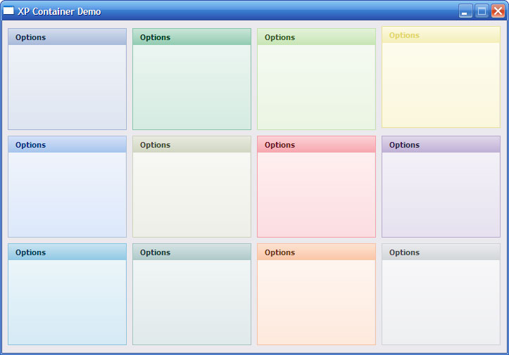



## XP Container Control \(UPDATED\)

### Description

A simple XP Style lightweight container Control.

Updates:

08/04/2005 - Resize Bug Fixed.
 
### More Info
 

             |
---                |---
**Submitted On**   |2005-04-07 09:43:26
**By**             |[Cameron Groves](https://github.com/Planet-Source-Code/PSCIndex/blob/master/ByAuthor/cameron-groves.md)
**Level**          |Beginner
**User Rating**    |4.9 (59 globes from 12 users)
**Compatibility**  |VB 6\.0
**Category**       |[Custom Controls/ Forms/  Menus](https://github.com/Planet-Source-Code/PSCIndex/blob/master/ByCategory/custom-controls-forms-menus__1-4.md)
**World**          |[Visual Basic](https://github.com/Planet-Source-Code/PSCIndex/blob/master/ByWorld/visual-basic.md)
**Archive File**   |[XP\_Contain187389482005\.zip](https://github.com/Planet-Source-Code/cameron-groves-xp-container-control-updated__1-59869/archive/master.zip)

